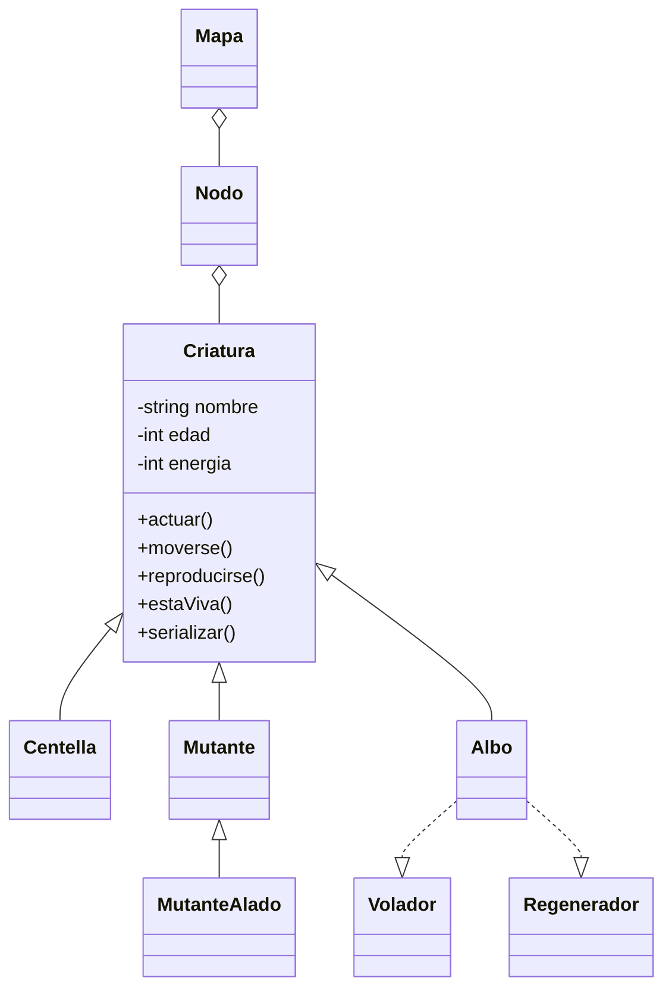

# 📘 Descripción del Proyecto

**Valle Iridiano** es un simulador de ecosistema implementado en C++ que modela la vida de criaturas fantásticas en un entorno dinámico y cambiante. Utiliza conceptos avanzados de programación orientada a objetos, como herencia, polimorfismo, composición y el uso de interfaces. Su propósito es representar un ecosistema donde cada criatura tiene comportamientos únicos, permitiendo observar la evolución de la población a lo largo de ciclos simulados.

🎯 **Problema que resuelve**: la dificultad de visualizar y aplicar los pilares de la POO en contextos prácticos.

👤 **Usuarios objetivo**: estudiantes de programación orientada a objetos, docentes que enseñan diseño de sistemas, y programadores curiosos.

---
### 💻 Creado por

Crinima 2.1 © 2025

---
### 🎶 Dedicado a
Profesorcito 💙.
---

---

# 🧑‍💻 Manual del Usuario

### ✨ Principales funcionalidades:

- Simula un entorno con múltiples criaturas.
- Cada tipo de criatura tiene su propio comportamiento y reglas de reproducción:
  - **Centella**: se reproduce si su energía es mayor a 10; pierde 2 de energía al actuar y 1 al moverse.
  - **Mutante**: se reproduce si su edad supera los 3 ciclos y tiene más de 15 de energía; gasta 1 de energía al actuar y 2 al moverse.
  - **MutanteAlado**: hereda el comportamiento del mutante pero se mueve más eficientemente, gastando solo 1 de energía al moverse.
  - **Albo**: se reproduce si su energía supera los 20; se regenera cada dos ciclos si su edad es par, ganando 2 de energía. Al moverse, vuela y pierde 2 de energía (1 por volar, 1 por moverse).
- Visualización por consola del estado del mapa.
- Guarda el historial de cada ciclo en un archivo `.json`.

### 🕹️ Cómo usar la aplicación:

1. Al ejecutar el programa, se genera un mapa aleatorio.
2. Se puebla automáticamente con criaturas (Centella, Mutante, MutanteAlado, Albo).
3. Cada ciclo simula:
    - **Actuar**: Cada criatura modifica su energía y envejece según su tipo.
    - **Moverse**: Cada criatura consume energía al desplazarse según su clase.
    - **Reproducirse**: Si cumple ciertas condiciones (edad, energía).
    - **Regenerarse**: Solo si implementa la interfaz `Regenerador` y hay recursos disponibles.

4. El resultado se imprime por consola y se guarda en `valleIridiano.json`.

### 📷 Ejemplo visual:
**Posición de las criaturas en los nodos:**

- `0`: Nodo sin criaturas.
- `1`: Nodo con 1 criatura.
- `2`: Nodo con 2 criaturas.
- `+`: Nodo con 3 o más criaturas.

```text
 0  1  0  +
 2  0  0  1
 ```

# 🛠️ Instrucciones de Compilación y Ejecución

### 🔽 Clonar e iniciar el repositorio:

```bash
git clone https://github.com/tu_usuario/valle-iridiano.git
cd valle-iridiano
git init  # Inicializa repositorio si no estaba
```
### 🌿 Crear y trabajar en ramas:

Durante el desarrollo del proyecto trabajamos con **dos ramas principales**: `Nicolle` y `Maria`. Cada integrante trabajó sus funcionalidades en su propia rama y al finalizar el desarrollo realizamos un **merge final** para fusionarlas y consolidar el proyecto completo.

```bash
git checkout -b nombre-de-tu-rama  # Crea y te ubica en la nueva rama
```

Realiza tus cambios en esa rama, luego usa:

```bash
git add .
git commit -m "Mensaje descriptivo"
git push  # Sube los cambios al repositorio remoto
```
Para revisar el estado del repositorio:
```bash
git add status
```
Para ver o cambiar a otra rama (por ejemplo, la de un compañero):
```bash
git checkout nombre-rama-compañero
git pull  # Trae los cambios de esa rama remota
```
# 🗂️ Estructura del Código Fuente

### 📁 Organización general:

```bash
📂 Proyectofinalvalle/
├── main.cpp
├── CMakeLists.txt
├── Criatura.{h,cpp}
├── Volador.h
├── Regenerador.h
├── Centella.{h,cpp}
├── Mutante.{h,cpp}
├── MutanteAlado.{h,cpp}
├── Albo.{h,cpp}
├── Nodo.{h,cpp}
├── Mapa.{h,cpp}
└── valleIridiano.json
```

### 🔑 Clases clave:

- `Criatura`: clase base abstracta que define los atributos y comportamientos esenciales de todas las criaturas.
- `Volador` y `Regenerador`: interfaces puras que declaran comportamientos especiales o sea los poderes (volar y regenerar).
- `Centella`: criatura ligera y veloz con reproducción basada en energía.
- `Mutante`: criatura adaptable que se reproduce con edad y energía suficientes.
- `MutanteAlado`: versión aérea del mutante, con menor gasto al moverse.
- `Albo`: criatura avanzada que combina vuelo, regeneración y evolución.
- `Nodo`: representa una celda del mapa, puede contener criaturas y recursos.
- `Mapa`: gestiona todos los nodos y regula el avance de ciclos en el ecosistema.
# 👥 Créditos y Roles del Equipo

**Equipo de desarrollo:**

- 💻 **Nicolle** — Encargada de la estructura del código, lógica del ecosistema y organización general.
- 🔀 **Maria** — Gestión de ramas Git, fusión final del proyecto y subida al repositorio remoto.
- 👨‍💻 **Cristian** — Apoyo estructural, colaboración en clases base y revisión del diseño.
- 🚀 **Nicolle y Maria** — Subieron las ramas al repositorio remoto desde local.
- 🎨 **Morillo** — Asistente digital del grupo: apoyo modular, documentación, estructura y explicaciones de POO.

**Profesor guía:** 👨‍🏫 Profesorcito
# 2️⃣ calificacion.md

### ✍️ Autoevaluación

- **Cristian**: 4.2 — Apoyó en la estructura del código y revisión de clases.
- **Maria**: 4.8 — Organizó y gestionó el manejo de ramas, incluyendo la subida desde local al repositorio remoto.
- **Nicolle**: 4.8 — Encargada de estructurar el código y coordinar los archivos fuente.

### 🤝 Coevaluación

- **Cristian**:
    - Maria: 5.0 — Lideró con claridad y precisión el control de versiones.
    - Nicolle: 5.0 — Lideró junto a María el control de versiones responsable en la lógica del código y la organización general.

- **Maria**:
    - Cristian: 4.0 — Cumplió con su aporte aunque de forma parcial.
    - Nicolle: 5.0 — Su estructura del código facilitó el trabajo en equipo.

- **Nicolle**:
    - Cristian: 4.5 — Motivó al equipo, fué muy constante aunque le faltó aportar un poco más.
    - Maria: 5.0 — Gestión sobresaliente de las ramas y del trabajo remoto.

# 3️⃣ uml.md


